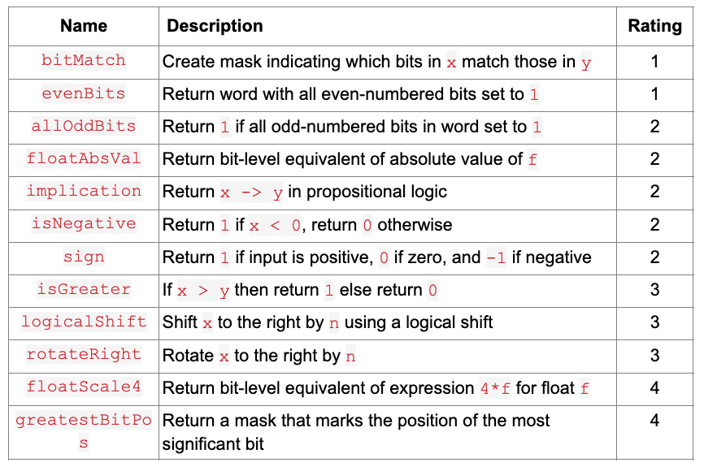
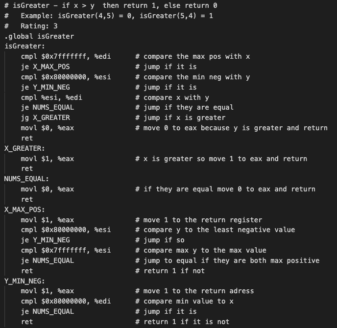
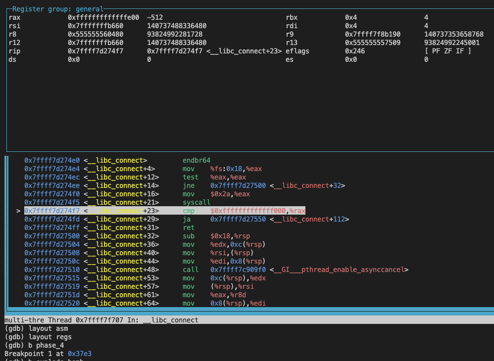

# GDB Bomb Defusal
Part 1 of this project was very similar to Bitwise Puzzle where we utilized the restrictions on operators like +, -, *, or / to translate functions. 

But this time we had to translate them into ASSEMBLY CODE line by line!



### What I Learned
- x86-64 Assembly: Particularly Shifts and Bitwise Manipulation. Like, (shll, sarl, etc.) AND, OR, XOR, and NOT.
- Register Usage: Understood the difference between caller-save and callee-save registers %rax, %rbx, %rcx, etc.,
- Shifts and Bitwise Manipulation: Like, (shll, sarl, etc.) AND, OR, XOR, and NOT in assembly.
- Labeling and Jump Instructions: Used jumps (jmp, jz, jne, etc.) to implement conditional logic and flow control, with clear labeling to maintain readability.
- Handling the Stack: Using %rsp to adjust stack size and push/pop to preserve register values when using callee-save registers.
- Use of TUI Mode: Gained experience using GDB's TUI mode for visualizing register states and assembly code simultaneously during debugging.

This showed me how registers worked and the different operations we can do on them. It got me much more acquainted with the low-level details of x86 and also gave me a greater appreciation for the features of “high-level” languages like C.



Part 2 Bomb! The goal is to defuse all the stages of a bomb without having it blow up to lose points. However, the trick is that when using the gdb you cannot see the C source code. You have to go line by line with a binary program in assembly stepping through/into its functions and loops.


### What I Learned
- Assembly Code Analysis: Particularly in identifying instructions like cmp, jmp, and mov.

- Debugging with GDB: Using step through, set breakpoints, and examining the program state to avoid triggering the bomb's explosion.

- Reverse Engineering: Examining how a binary program operates without access to the source code, using tools like GDB and objdump.

- Binary and Hexadecimal Understanding: Commonly used in low-level programming and debugging.

- Use of Disassembly Tools: Used objdump to disassemble binary files and analyze their entire source code in assembly form.

Here is what it looks like below



This made me understand assembly a lot more because I could enable the registers and see what was in them after completing each line. I could jump to different functions and set breakpoints and ones I didn’t want to run, (like the explode_bomb function).

## <a href="https://www.youtube.com/watch?v=UNz9k9E9IWM"> Demo Video on YouTube </a>

## Setup

If you want to play around with Bitwise Puzzle, feel free to clone my repo. To start, please enter the following commands on your terminal:

```
git clone https://github.com/CamNagle24/Bitwise-Puzzle
make
```

At this point, you are free to type in whatever sequence of commands you like.

```
./btest
```

./btest will give you all the tests that the code tests and passes.
